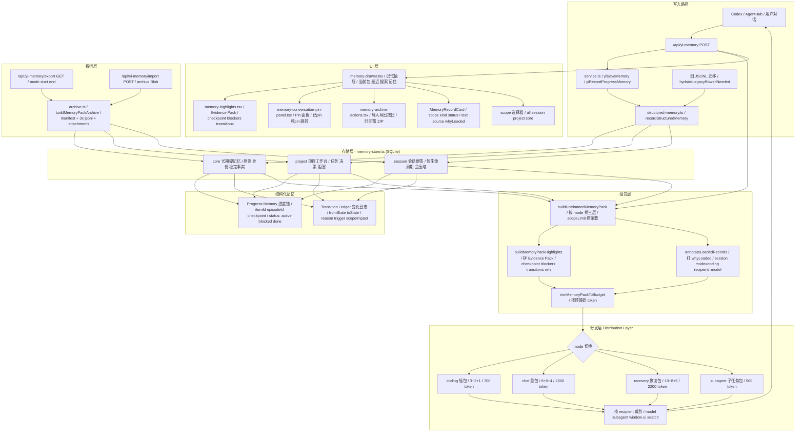

# AgentHub 记忆系统总架构

> 生成日期：2026-06-23
> 基于 [memory-layer-design](./2026-06-20-agenthub-memory-layer-design.md) 和 [memory-mode-token-rules](./2026-06-21-agenthub-memory-mode-token-rules.md) 的落地实现

## 架构全图



## 核心文件对应

| 层 | 文件 |
|---|---|
| 入口 | `src/app/api/yi-memory/route.ts` |
| 服务门面 | `src/server/yi-memory/service.ts` |
| 结构化写入 | `src/server/yi-memory/structured-memory.ts` |
| 存储引擎 | `src/server/yi-memory/memory-store.ts` |
| 打包导入导出 | `src/server/yi-memory/archive.ts` |
| 前端 API 客户端 | `src/lib/memory-api.ts` |
| 记忆抽屉 | `src/components/memory-drawer.tsx` |
| 证据面板 | `src/components/memory-highlights.tsx` |
| Pin 面板 | `src/components/memory-conversation-pin-panel.tsx` |
| 导入导出按钮 | `src/components/memory-archive-actions.tsx` |
| 导出 API | `src/app/api/yi-memory/export/route.ts` |
| 导入 API | `src/app/api/yi-memory/import/route.ts` |

## 三层存储

| scope | 用途 | 隔离键 | 生命周期 |
|---|---|---|---|
| `core` | 长期硬记忆：原则、身份、稳定事实 | userId | 永久，只追加不删除 |
| `project` | 项目工作台：当前任务、决策、阻塞 | userId + workspaceId + projectKey | 跨会话，可能变化 |
| `session` | 会话便签：当前对话临时上下文 | conversationId | 会话内，会压缩 |

## 结构化记忆

### Progress Memory
进度链，回答"现在做到哪了"。
- `itemId` -> `episodeId` -> `checkpoint`
- `status`: active / blocked / waiting / done / abandoned
- `blockedReason` + `nextAction` 用于恢复

### Transition Ledger
变化日志，记"为什么上下文变了"。
- `fromState` -> `toState`
- `reason` / `trigger` / `scopeImpact` / `recoveryTarget`

### Evidence Pack
发给模型的证据包，组包时自动拼装：
- 最新 checkpoint
- 阻塞项 (blockers, 最多 3 条)
- 关键 transition (最多 4 条)
- 证据引用 (evidenceRefs, 最多 5 条)

## 模式切换

| mode | session | project | core | token 预算 | 用途 |
|---|---|---|---|---|---|
| `coding` | 3 | 2 | 1 | 700 | 写代码，最轻 |
| `chat` | 8 | 6 | 4 | 2800 | 聊天，最重 |
| `recovery` | 10 | 8 | 6 | 2200 | 恢复，条数最多 |
| `subagent` | 4 | 2 | 1 | 500 | 子任务，极简 |
| `search` | 0 | 0 | 0 | 500 | 纯搜索，不经分层 |

## 分发策略

1. 先按 `recipient` 分发，再按 `mode` 裁剪
2. 先按 relevance + freshness 分发，再按 budget 收缩
3. 先发最新 checkpoint、关键 transition、阻塞点、硬约束，再补背景
4. 同一条记录不在三层重复出现
5. `whyLoaded` 标签随记录进 UI，解释加载原因

## MemoryPack 导出格式

```
archive.zip
  manifest.json          格式版本、时间窗、counts、warnings
  core-memory.jsonl      core 层全部记录
  project-memory.jsonl   project 层记录
  session-memory.jsonl   session 层记录
  attachments/           引用的附件文件
```

- 支持按项目、按时间窗、按 mode 导出
- 导入时自动 remap conversationId / projectKey
- 缺失附件生成 warning 不阻断导出

## UI 入口

| 组件 | 功能 |
|---|---|
| `memory-drawer.tsx` | 记忆抽屉主面板，4 tab：当前包 / 最近 / 搜索 / 记住 |
| `memory-highlights.tsx` | Evidence Pack：checkpoint / blockers / transitions / refs |
| `memory-conversation-pin-panel.tsx` | 会话 Pin：已 pin + 可 pin + 跳转 |
| `memory-archive-actions.tsx` | 导入/导出：时间窗 + 下载/上传 ZIP |
| `MemoryRecordCard` | 记忆卡片：scope / kind / status / text / source / whyLoaded |
| scope 选择器 | 搜索时按 all / session / project / core 过滤 |

## 验收状态

- [x] 分层存储 (session / project / core)
- [x] Progress Memory 进度链
- [x] Transition Ledger 变化日志
- [x] Evidence Pack 证据组包
- [x] Distribution Layer 模式分发
- [x] scope 搜索 / 语义搜索
- [x] whyLoaded 加载原因
- [x] MemoryPack 导入 / 导出
- [x] manifest.json + 三层 jsonl + attachments
- [x] 导出时间窗
- [x] 记忆抽屉 UI
- [x] Pin 面板
- [x] 导入导出按钮
- [x] typecheck 通过
- [x] 记忆相关 vitest 全绿
- [ ] 忆 AI OS 总架构 (独立任务)
- [ ] AI OS 前端原型 (独立任务)